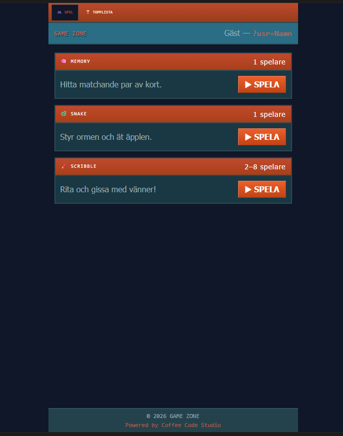

# StajlPlejs Game Zone

En spelmodul byggd för StajlPlejs — ett svenskt nostalgicommunity med 40 000 registrerade medlemmar.

## Spel

| Spel | Typ | Anti-cheat |
|------|-----|-----------|
| 🧠 Memory | Single-player | Server-side validering |
| 🐍 Snake | Single-player | Server-side validering |
| 🖌️ Scribble | Multiplayer (2–8) | — |

## Integration

Inbäddas som iframe på stajlplejs.se. Användarnamnet skickas via URL-parameter:

```html
<iframe
  src="https://stajlplejsgames.vercel.app?usr=Användarnamn"
  width="100%"
  height="800"
  frameborder="0"
  scrolling="yes"
></iframe>
```

## Teknik

- **Frontend:** React 18 + TypeScript, Vite, Tailwind CSS, shadcn/ui
- **Databas:** Supabase (Postgres + Realtime)
- **Edge Functions:** Supabase (Deno) — server-side score-validering
- **Hosting:** Vercel

Se [ARCHITECTURE.md](./ARCHITECTURE.md) för fullständig systemdokumentation.

## Setup

### Miljövariabler (Vercel)

```env
VITE_SUPABASE_URL=https://<project-id>.supabase.co
VITE_SUPABASE_PUBLISHABLE_KEY=sb_publishable_...
VITE_SUPABASE_PROJECT_ID=<project-id>
```

### Databas

Kör `supabase/migrations/001_initial_schema.sql` i Supabase SQL Editor.

### Edge Functions

Deploya via Supabase dashboard eller CLI:

```bash
npx supabase functions deploy snake-game --project-ref <project-id>
npx supabase functions deploy memory-game --project-ref <project-id>
```

## Screenshot



## Byggd av

[Coffee Code Studio](https://coffeecodestudio.se)
